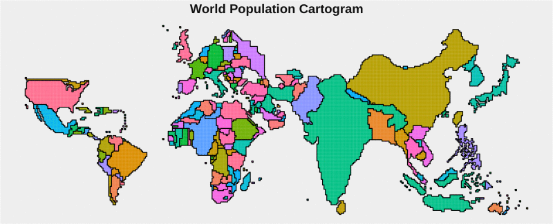
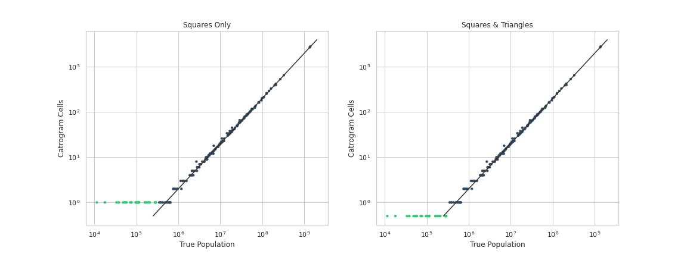

# 🗺️ World Population Cartogram
This repository contains a set of data able to reproduce [Max Roser](https://github.com/OurWorldInData-User)'s beautiful masterpiece for "Our World in Data" -- The World Population Cartogram.


## 🙌 Motivation
From Wikipedia:
> A cartogram is a map in which some thematic mapping variable – such as travel time, population, or GNP – is substituted for land area or distance

Good cartograms are notoriously difficult to make, as they require a careful balance of distorting distance, area, & shape -- enough to match the target variable, but not too much causing the countries to become unrecognizable.  For this reason, cartograms that are generated purely algorithmically are generally of low quality.  Hence my motivation for this repo.  **Max Roser's map is fantastic and should be available for anyone and everyone to easily build upon.**  In fact, it's so good, it's the first image in the [wikipedia entry for "cartogram"](https://en.wikipedia.org/wiki/Cartogram).

Here's a small gallery of graphics I made using this cartogram layout:


## 🔢 About the Data and its Format

### The Square Grid
The cartogram is composed ~15,000 square* cells within a grid.  Each cell represents a population of 500,000 (0.5M) people who reside in its corresponding country.  This means that the only information necessary to represent the **World Population Cartogram** is a list of tuples: `{X, Y, Country}` describing which cells map to which countries.  To avoid dealing with spelling mismatches and other localization glitches, this repo uses [ISO 3166-1](https://en.wikipedia.org/wiki/ISO_3166-1) country codes to identify countries.

#### cells.csv
For example, the following 11 rows represent the 4.7M people (9 cells) of New Zealand (`ISO: 554`) and the 0.9M people (2 cells) of Fiji (`ISO: 242`)
```
X,    Y,    CountryCode
337,  0,    554
338,  1,    554
338,  0,    554
339,  2,    554
339,  1,    554
340,  5,    554
340,  4,    554
340,  3,    554
341,  4,    554
340,  9,    242
340,  8,    242
...
```

#### borders.csv
For convenience, the aggregate polygons are also computed (using `computeBoundaries.py`) & written to a CSV file which looks like this:
```
X,    Y,   PolygonID, CountryCode, BorderType
...
163,  63,  295,       262,         Exterior
163,  64,  295,       262,         Exterior
164,  64,  295,       262,         Exterior
164,  63,  295,       262,         Exterior
166,  25,  296,       480,         Exterior
166,  24,  296,       480,         Exterior
165,  24,  296,       480,         Exterior
...
```
Needing to describe a `BorderType` as either `Exterior` or `Interior` may come as a surprise to you. If so, please checkout [South Africa & Lesotho](https://ourworldindata.org/uploads/2018/09/Population-cartogram_Africa-768x925.png). South Africa, therefore has two `PolygonID` associated with it. One `Exterior` border, and one `Interior` border.

It should be noted that the borders are not `cells` themselves. They do not "take up space". They are merely just zero-width representations of the perimeters of each country.

#### Cells & Borders Playing Together
`cells.csv` can be thought of as descriptions of the pixels that make up the cartogram. `borders.csv` describe the perimeters that lie around groups of pixels.

Using them together introduces one slight complication:
Each `cell` is technically a region itself, a 1x1 rectangle.  The `cells.csv` however only represents it as a single `{X,Y}` point.  **The convention here is that a `cell`'s `{X,Y}` coordinate is specifically referring to its lower-left (south-west) corner.**  For example, a single-`cell` Country at `{X=100, Y=200}` would have a `border` of `[{X=100, Y=200}, {X=101, Y=200}, {X=101, Y=201}, {X=100, Y=201}]`


### Triangles...?
Because of the fact that there are a handful of (mostly island) nations with a population less than the 500,000 cell-size, these countries being represented by a full square cell can be a little misleading.  Max Roser's Cartogram addresses this by carving out a special type of cell just for this, a half-filled cell in the shape of a triangle.  Just look in the [Carribean](https://ourworldindata.org/uploads/2018/09/Population-cartogram_Americas-768x978.png) or the [South-Pacific](https://ourworldindata.org/uploads/2018/09/Population-cartogram_Asia-and-Oceania-768x531.png) for a few examples of these triangles.

In my view, while the triangles are cute, I personally prefer the aesthetic that you get from all-squares.
Plus, the triangles don't really help all that much in making the area directly proportional to population.


Because it really just comes down to personal preference, two versions of the data are made available. One in `data/*/squares/` and the other in  `data/*/squares_and_triangles/`.  That way, you can choose whichever you prefer!

The `borders.csv` file behaves the same way in the `data/*/squares_and_triangles/` directory as it does in the `data/*/squares/` directory, explained above.  There is a slight difference when handling `cells.csv` however.

Because a single square-cell can now contain two triangles, we need a way to identify that. Thus, `boolean` columns: `LowerLeft` and `UpperRight` are introduced.
```
X,   Y,   CountryCode, LowerLeft, UpperRight, IncludeInSquares
165, 24,  480,         1,         1,          1
166, 25,  480,         1,         1,          1
127, 36,  678,         0,         1,          1
133, 102, 380,         1,         0,          0
...
```
* a row where both `LowerLeft==1` & `UpperRight==1` is a square
* a row where only 1 of `LowerLeft==1` or `UpperRight==1` is a triangle
* a row where `IncludeInSquares==0` is not included as a square in `/squares/cells.csv` file
    * this is very rare, the only instances are the portions of `Italy` that are replaced by squares for `Vatican City` and `San Marino`


## 👩‍💻 Using The Data (Example Code)

### R

```R
library(ggplot2)
cellsDF   <- read.csv('https://raw.githubusercontent.com/mattdzugan/World-Population-Cartogram/master/data/year_2018__cell_500k/squares_and_triangles/cells.csv')
bordersDF <- read.csv('https://raw.githubusercontent.com/mattdzugan/World-Population-Cartogram/master/data/year_2018__cell_500k/squares_and_triangles/borders.csv')

ggplot()+
  theme_void()+
  theme(legend.position = 'none')+
  geom_tile(data=cellsDF,   aes(x=X+.5, y=Y+.5, fill=as.factor(CountryCode)), color=NA)+
  geom_path(data=bordersDF, aes(x=X, y=Y, group=PolygonID))+
  coord_fixed()
```

### Python
```Python
import numpy as np
import pandas as pd
from matplotlib.collections import PatchCollection
import matplotlib
import matplotlib.pyplot as plt

borders = pd.read_csv("https://raw.githubusercontent.com/mattdzugan/World-Population-Cartogram/master/data/year_2018__cell_500k/squares_and_triangles/borders.csv")
cells   = pd.read_csv("https://raw.githubusercontent.com/mattdzugan/World-Population-Cartogram/master/data/year_2018__cell_500k/squares_and_triangles/cells.csv")

fig = plt.figure()
ax = fig.add_subplot(111, aspect='equal')
plt.xlim([0, max(cells["X"]+1)])
plt.ylim([0, max(cells["Y"]+1)])
n=cells.shape[0]
patches = []
for i in range(0,n):
    patches.append(matplotlib.patches.Rectangle((cells.loc[i,"X"], cells.loc[i,"Y"]),1,1))
ax.add_collection(PatchCollection(patches, color="#111111", alpha=0.1))
for p in np.unique(borders["PolygonID"]):
    ax.plot(borders.loc[borders["PolygonID"]==p, "X"], borders.loc[borders["PolygonID"]==p, "Y"])
plt.show()
```

### D3.js
```js
cells = d3.csv("https://raw.githubusercontent.com/mattdzugan/World-Population-Cartogram/master/data/year_2018__cell_500k/squares/cells.csv", function(d){
  return {
    X : +d.X,
    Y : +d.Y,
    Country : d.CountryCode,
  };
})

const xmin   = d3.min(cells, d => d.X);
const xmax   = d3.max(cells, d => d.X)+1;
const ymin   = d3.min(cells, d => d.Y);
const ymax   = d3.max(cells, d => d.Y)+1;
const height = width/(xmax-xmin)*(ymax-ymin);
const svg    = d3.create("svg")
                 .attr("viewBox", [0, 0, width, height])
                 .style("background", "#ffffff");

var x     = d3.scaleLinear().domain([xmin, xmax]).range([0, width]);
var y     = d3.scaleLinear().domain([ymin, ymax]).range([height, 0]);
var color = d3.scaleOrdinal(['#7F3C8D','#11A579','#3969AC','#F2B701','#E73F74',
                             '#80BA5A','#E68310','#008695','#CF1C90','#f97b72','#4b4b8f']);

const cell = svg.selectAll("rect")
                .data(cells)
                .enter()
                .append("rect")
                .attr("x", d => x(d.X))
                .attr("y", d => y(d.Y+1))
                .style("stroke-width",1)
                .style("stroke", d => color(d.Country))
                .style("fill", d => color(d.Country))
                .attr("height",y(0)-y(1))
                .attr("width",x(1)-x(0));
```


## 📖 About this Repo
Certainly the main feature of this repository is the set of artifacts housed in the `data/` folder.

There is however a small set of code in `src/` that assists in creating some of these data artifacts.
```
                                                                /squares_and_triangles
                                                                |--- cells.csv
                                                                |--- borders.csv
/squares_and_triangles/cells.csv  -->  computeBoundaries.py -->
                                                                /squares
                                                                |--- cells.csv
                                                                |--- borders.csv
```
Specifically: `/squares_and_triangles/borders.csv`, `/squares/cells.csv` & `/squares/borders.csv` are all generated by `computeBoundaries.py` via the single `/squares_and_triangles/cells.csv` data file.

This architecture is meant to assist in potential expansion of the repository to house future cartogram designs (maybe different years, or different persons-per-cell).  All that a contributor would need to manually generate is a `/squares_and_triangles/cells.csv` file. The rest can be automatically generated by `computeBoundaries.py`

In `src/` you'll also find some code `plotTilingAccuracy.py` that compares country population to # cells, as well as `demo.R` which contains the code necessary to generate the demo image in the introduction.


## ⁉️ FAQ

### Where is the code that processed the original Image to create this dataset?
Well... it doesn't exist. The dataset was created by manually examining & transcribing the image.  I originally set out to automate most of this process, specifically, algorithmically determining the regional boundaries of each country (using the color of the source image) and mapping those to the lower-resolution grid.  However once I noticed that the original image had some _quirks_ (inconsistent size of grid-cells, inconsistent size of gridlines) - I determined it'd take me longer to write the code to handle all the corner-cases than it would take for me to just manually transcribe the map.  Plus, there's no feasible way to automate the _labeling_ (once the polygons are defined) of which polygon maps to which country, so that piece would always be manual.

#### How can make a version of this for a different year?
This is unfortunately not easy.  Imagine for a moment we wanted a similar version of this map for the year 2000.  There are a many countries where population has increased by more than 500,000 people from 2000 to 2018, this means that the 2000 map would need less cells. So which cells should we delete?  It's not obvious that there's a sensible way to do this. Then once we delete a cell, we'll need to push the adjacent countries over to fill the new gap -- but how do we do that while maintaining the shape of the countries? It quickly becomes a logistical nightmare that would be difficult to solve (well) algorithmically.

If you come up with something you like, please create a **Pull Request** & I will consider adding it to this repo.

#### How can make a version of this for a different cell-size (other than 500,000 persons/cell)?
This is maybe a little more straightforward than the above, but still challenging.

I suspect a simple resampling of the image would get 90% of the way there.  Using something like [scipy.ndimage.zoom](http://scipy.github.io/devdocs/generated/scipy.ndimage.zoom.html#scipy.ndimage.zoom) with `mode='nearest'` will increase the change the resolution of the grid.  Then some manual attention would likely be needed to handle the nuances of country boundaries.

If you come up with something you like, please create a **Pull Request** & I will consider adding it to this repo.

#### Where's Russia?
It's over there. To the left. Further... keep going... further. Yep, there it is.

#### Do the coordinates refer to Latitude & Longitude?
No! Despite the fact that the values may appear to be in the same range as Latiude and Longitude, this is purely a coincidence.  The exact values of the coordinate-system are completely arbitrary.  For this reason, I'd suggest always removing axis labels, tick marks, and any gridlines/graticule from visualization of this data.

#### This thing looks so weird, why would I ever use it?
Humans subconsiously find 'bigger things' more memorable and striking. So when seeing a graphic like this one of [Countries by System of Government](https://en.wikipedia.org/wiki/List_of_countries_by_system_of_government)

... it is only natural to overlook the shade of orange representing `Parliamentary republic with a ceremonial presidency`. There just simply aren't many orange pixels on this map.

A map like the `World Population Cartogram` which provides visual weight proportional to population, would solve this problem.

#### This thing is cool, why would I ever NOT use it?
Not everything makes sense when tied to population.
For example a map showing each country's `year of founding` or `length of its wikipedia article` may not benefit from a population-weighted view.


## 📒 Citations
Max Roser (2018) – "The map we need if we want to think about how global living conditions are changing". Published online at OurWorldInData.org. Retrieved from: ‘https://ourworldindata.org/world-population-cartogram’ [Online Resource]

Max's relevant citations:
>This data I took from the UN Population Division and you can access that data and visualize it for other countries on our map here. https://ourworldindata.org/grapher/UN-population-projection-medium-variant?year=2018
The 2018 data is a future projection that the UN Population Division created last year.
Other data – the US in 1776, the population of various metropolitan areas, and the population of some small countries – are mostly from Wikipedia.

Our World In Data [copyrights their work](https://ourworldindata.org/how-to-use-our-world-in-data#how-is-our-work-copyrighted) under a [CC-BY license](https://creativecommons.org/licenses/by/4.0/legalcode).
